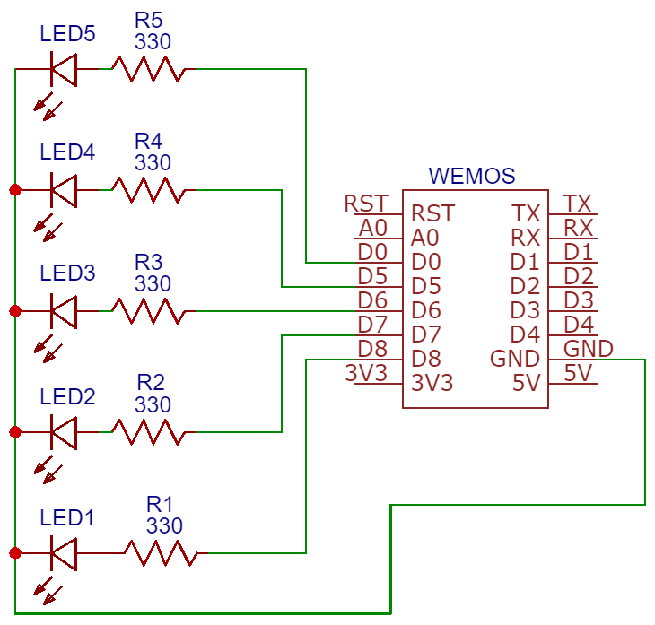

# 2019 Diplomarbeit Entsorgungskalenderanzeige Frontend Hardware

## Bau der Hardware
[Bauanleitung auf Instructables](https://www.instructables.com/id/Entsorgungskalenderanzeige-Frontend-Diplomarbeit-H/)  
Hardware basiert auf dem [Wemos D1 mini](https://wiki.wemos.cc/products:d1:d1_mini)  
In der folgenden Abbildung ist der Schaltplan, wie die fünf LEDs angeschlossen werden.

## Installation für die Nutzung // Code kompilieren und hochladen
1.  [Visual Studio Code](https://code.visualstudio.com/)
2.  [PlatformIO IDE](https://platformio.org/platformio-ide)

### Konfiguration und Einsatz der Entsorgungskalenderanzeige
Bitte tragen Sie ihre den Wlan-Namen / Passwort und Ihren Entsorgungskreis (siehe unten) in der Datei 'src/userConfiguration.h' ein.
Die fünf LEDs an den gewünschten Pin anschliessen (im Code definiert), kompellieren und auf den Wemos D1 mini hochladen.

In der Gemeinde Rapperswil-Jona liegen folgenden Kreise vor (Stand 2019):  
Jeder Kreis der Gemeinde hat eine ID und einen Kreisbeschreibung:  

|Kreis ID|Kreisbeschreibung|
|--------|-----------------|
|1       |1                |
|2       |1a               |
|3       |1b               |
|4       |2                |
|5       |3                |
|6       |4                |
|7       |5                |
|8       |6                |
|9       |7                |
|10      |8                |
|11      |9                |

## Benutzerhandbuch

Die 5 Leds repräsentieren die 5 Entsorgungsgüter:

Das erste Led steht für Grüngut  
Das zweite Led steht für Karton  
Das dritte Led steht für allgemeiner Abfall (Kehricht) und Sperrgut  
Das vierte Led steht für Metall  
Das fünfte Led steht für Papier  

Wenn das Led dauerhaft leuchtet, darf das entsprechende Entsorgungsgut an die Strasse gestellt werden.

### Mögliche Fehlermeldungen

Wenn ein oder mehre Leds blinken, liegt eine Störung vor:

Wenn ein Led blinkt = Keine Verbindung zum Wifi --> Netwerkname und Passwort korrekt?  Wlan ausgeschaltet?  
Wenn zwei Leds blinken = Keine Verbindung zum Host («Internet») --> Hat das Wifi Zugang zum Internet?  
Wenn drei Leds blinken = Die aufgerufene URL gibt keinen "HTTP 200 OK"-Status zurück --> Ist die Abfrage korrekt konfiguriert? Hat die API sich verändert?  
Wenn vier Leds blinken = API nicht richtig konfiguriert --> Ist der Kreis eingetragen? Ist die richtige Kreisnummer eingetragen?  
Wenn fünf Leds blinken = Bitte starten Sie die Anzeige neu --> Sekundäre Fehlermeldung beachten    

## Bemerkung: Die Lösung wurde mit den folgenden Tools entwickelt
1.  [Ardunio IDE](https://www.arduino.cc/en/main/software) mit [ESP8266](https://github.com/esp8266/Arduino)  
2.  [Visual Studio](https://visualstudio.microsoft.com/de/downloads/) mit [Arduino IDE for Visual Studio](https://marketplace.visualstudio.com/items?itemName=VisualMicro.ArduinoIDEforVisualStudio)
